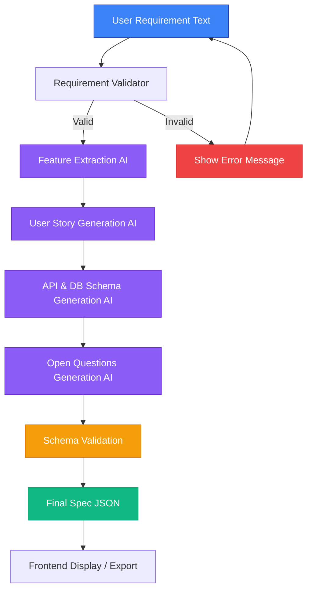

# 🤖 AI Spec Generator

> Transform messy requirements into crystal-clear technical specifications with AI-powered automation

## 📋 Description

**AI Spec Generator** is an intelligent tool that automatically converts unstructured requirements into comprehensive technical specifications. Simply paste your requirements, and let AI do the heavy lifting—generating modules, features, user stories, API endpoints, and database schemas in seconds.

Perfect for developers, project managers, and technical leads who want to:
- ⚡ Speed up specification writing
- 📊 Standardize documentation format
- 🎯 Reduce ambiguity in requirements
- 🔄 Iterate and refine specifications quickly

---

## ✨ Features

### Core Capabilities
- 📝 **Requirements Analysis** - Parse and understand messy text inputs
- 🧩 **Module Extraction** - Automatically identify software modules
- 🎯 **Feature Detection** - Extract explicit and implicit features
- 📖 **User Story Generation** - Create standard format user stories
- 🔌 **API Endpoint Suggestions** - Generate RESTful API designs
- 🗄️ **Database Schema Design** - Propose optimal table structures
- 🔄 **Iterative Refinement** - Improve specs through feedback loops

### User Experience
- 🌓 **Dark/Light Theme** - Beautiful themes with smooth transitions
- 📱 **Fully Responsive** - Perfect on mobile, tablet, and desktop
- 🎨 **Syntax Highlighting** - Color-coded JSON output
- 📋 **One-Click Copy** - Export specifications instantly
- ⚡ **Real-time Processing** - Fast AI-powered generation
- ♿ **100% Accessible** - WCAG 2.1 compliant

---

## 🛠️ Tech Stack

### Frontend
- **Framework:** Next.js 16
- **Language:** TypeScript
- **Styling:** Tailwind CSS v4
- **Theme:** Custom Context API with CSS Variables
- **Icons:** Lucide React

### Backend
- **Runtime:** Node.js
- **Framework:** Express.js
- **Language:** TypeScript
- **AI Integration:** Claude AI API (Anthropic)

## 🔄 Application Flow


---

## 🚀 How to Run the Project

### Prerequisites
- **Python:** 3.10 or higher
- **Node.js:** 18 or higher
- **npm:** Latest version
- **Groq API Key:** Get from [Groq Console](https://console.groq.com/)

---

### 🔹 Backend Setup
#### 1. Navigate to Backend Directory
```bash
cd backend
```
#### 2. Install Dependencies
```bash
pip install -r requirements.txt
```
#### 3. Create Environment File
Create a `.env` file in the `backend` directory:
```env
GROQ_API_KEY=your_groq_api_key_here
MAX_RETRIES=2
```
#### 6. Run the Server
```bash
uvicorn app.main:app --reload

```
✅ **Backend runs at:** `http://127.0.0.1:8000`

📚 **API Documentation:** `http://127.0.0.1:8000/docs`

---  

### 🔹 Frontend Setup

#### 1. Navigate to Frontend Directory
```bash
cd frontend
```

#### 2. Install Dependencies
```bash
npm install
```

#### 3. Create Environment File
Create a `.env.local` file in the `frontend` directory:
```env
NEXT_PUBLIC_API_URL=http://127.0.0.1:8000
```

#### 4. Run Development Server
```bash
npm run dev
```

✅ **Frontend runs at:** `http://localhost:3000`

---

## 🧪 Example Usage

### Sample Input
```text
Build a task management system where users can create, edit, and manage tasks with priorities and due dates.
```

## 📌 Summary

This project demonstrates:

✅ **Real-world AI pipeline design** - Production-ready architecture with proper error handling

✅ **Strong backend validation practices** - Pydantic schemas and input validation ensure data integrity

✅ **Modern frontend UX engineering** - Accessible, responsive, and performant user interface

✅ **Production-ready architecture** - Environment configuration, logging, and deployment ready

✅ **Clear separation of concerns** - Modular design for maintainability and scalability

It is designed to be **extendable**, **deployable**, and **interview-ready**.

---

